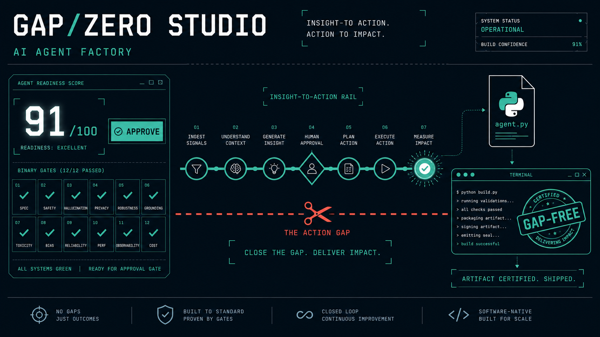
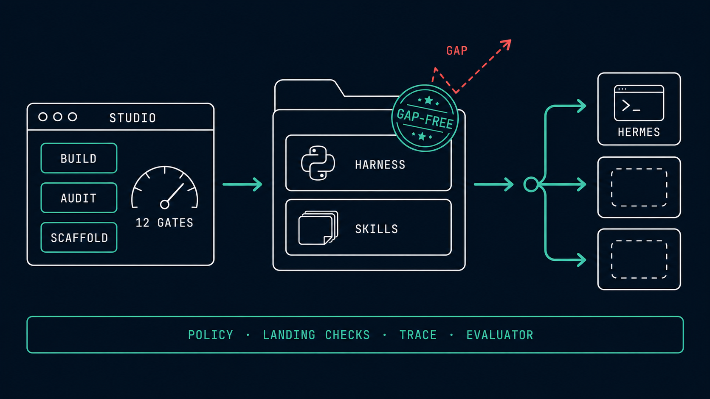

<p align="center">
  
</p>

# GAP/ZERO — Certified Gap-Free AI Agents

**Agents building Agents with Zero operational GAPS.** Build · Audit · Certify · Deploy. GAP/ZERO is an agent factory built on one conviction: *intelligence without actuation is worthless.* Every agent that leaves this repo has its insight-to-action pipeline fully wired, landing-checked, policy-gated, and independently evaluated — certified against 12 binary gates before it ships.

An [Agentic Future](https://github.com/FabioVinelli) project — Agents-as-a-Service for business automation.

---

## Why "GAP/ZERO"

Most enterprise AI pilots die in the gap between *insight* and *executed action*: dashboards nobody acts on, copy-paste human middleware, pilots with no kill criteria. The GAP/ZERO Agent Build Standard (doctrine: Craig Le Clair's *Agentic Action Gap*, Anthropic harness engineering) closes that gap structurally:

| Layer | Guarantee |
|---|---|
| **L0 Outcome contract** | One business metric, baseline → target, named accountable owner — or the build stops |
| **L1 Harness & memory** | Procedural / semantic / episodic stores; episodic doubles as an immutable accountability ledger |
| **L2 Loop & actuation** | Bounded loop with exit taxonomy; every tool declares mechanism + deterministic landing check + reversibility; policy engine rules on every write pre-execution |
| **L3 Human touchpoint** | Humans are endpoints, never middleware — max ONE validation step, with owner, detection, and rollback named |
| **L4 LLM Ops** | Generator ≠ evaluator: a separate skeptical evaluator grades every run from the trace, not the prose; no landed action = FAIL |
| **L5 Closed-loop PoC** | Sprint contract, success metric, pre-committed kill criteria, scale criteria, review trigger |

**Certification:** 12 binary gates + a 100-point score across friction, time-to-action, trust, and quality+governance. `APPROVE ≥ 75` with all gates passing — anything less does not ship. A blueprint with a declared gap is *blocked from scaffolding by the build system itself.*

## How it works

<p align="center">
  
</p>

<p align="center"><em>The Studio certifies · the stamp rejects anything with a declared gap · the package onboards onto any platform.<br>Underneath every agent: policy engine, landing checks, JSONL trace, separate evaluator.</em></p>

## What's in this repo

```
GAP-ZERO-AGENTS/
├── agents/                          ← certified, deploy-ready agents (the product)
│   └── hermes-transfer-probe-v1/    ← platform-onboarding verification agent (APPROVE 91/100, 12/12 gates)
│       ├── blueprint.json           ← the certified GAP/ZERO blueprint (authoritative spec)
│       ├── src/                     ← Python enforcement harness: loop, policy engine, registry,
│       │                              landing checks, JSONL trace, separate evaluator
│       ├── hermes/                  ← platform onboarding layer: AGENTS.md contract, skills, test plan
│       └── poc.md                   ← sprint contract, kill/scale/review criteria
├── gapzero-studio 2/                ← GAP/ZERO Studio: the factory (local web app that builds,
│                                      audits, scores, scaffolds, and live-tests agents)
├── GAPZERO-Agent-Build-Standard-v2.md   ← the normative standard
└── AGENTS.md                        ← repo-level agent context
```

## Onboard an agent (Hermes Agent, macOS)

Certified agents onboard through the platform's own surface — no dev workflow required. Example with `agents/hermes-transfer-probe-v1` on [Hermes Agent](https://hermes-agent.nousresearch.com) v0.17+:

```bash
# 1 · Get the agent
git clone https://github.com/FabioVinelli/GAP-ZERO-AGENTS.git
cd GAP-ZERO-AGENTS/agents/hermes-transfer-probe-v1

# 2 · Register it as a workspace
hermes project create "Hermes Transfer Probe v1"
hermes project add-folder . && hermes project use "Hermes Transfer Probe v1"

# 3 · Install its skills (direct SKILL.md URLs; Hermes scans each before install)
BASE=https://raw.githubusercontent.com/FabioVinelli/GAP-ZERO-AGENTS/main/agents/hermes-transfer-probe-v1/hermes/skills
for s in gapzero-doctrine gapzero-evaluator environment-fingerprint file-round-trip-test shell-execution-test structured-echo-test; do
  hermes skills install --category gapzero --yes "$BASE/$s/SKILL.md"
done

# 4 · In chat: "Load the gapzero-doctrine skill and run the first-run bootstrap,
#     then execute a verification cycle."
#     (The agent builds its own venv; your only manual step is pasting an API key into .env.)
```

Full tiered test plan — local model → cloud model → harness enforcement → cross-check — lives in each agent's `hermes/HERMES_TEST.md`.

## Build your own agent (GAP/ZERO Studio)

```bash
cd "gapzero-studio 2"
npm install && cp .env.example .env       # add your ANTHROPIC_API_KEY (server-side only)
npm run dev                               # Studio at http://localhost:5173
```

**BUILD** a blueprint from a plain-language use case, or **AUDIT** an existing agent spec — the engine scores it, runs the 12 gates, and ledgers every gap by severity. **SCAFFOLD** turns an APPROVE blueprint into the full Python harness + platform onboarding layer in one click, and **LAUNCH TEST RUN** executes the agent end-to-end with the separate evaluator grading the trace. Incomplete blueprints are auto-repaired once and hard-blocked if gaps remain: *a declared GAP does not ship.*

## Doctrine in one paragraph

Every insight ends in a landing-checked action, a validated handoff, or an explicit block — a bare report is a failure mode. The policy engine rules on every write before it executes; anything irreversible always escalates to the one named human validator, and a missing validator means veto, never assumed approval. The evaluator never grades its own generator's work and trusts only the trace. Every pilot pre-commits its kill criteria. If Hermes (or any platform runtime) and the Python harness disagree, the harness trace wins.

## Roadmap

- [x] GAP/ZERO Studio v2 — build / audit / scaffold / live-test, gap-free enforcement
- [x] Hermes Agent export layer + first certified agent (`hermes-transfer-probe-v1`)
- [ ] Hermes onboarding validation on Apple Silicon (tiered PoC, local + cloud backends)
- [ ] Second platform export target (one blueprint → many platforms)
- [ ] Published GAP/ZERO skill packs (skills.sh / ClawHub) — certified agents, one install command

---

© 2026 Fabio Vinelli · Agentic Future. All rights reserved.