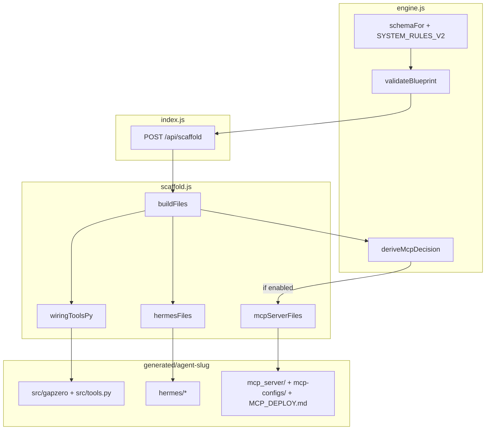

# GAP/ZERO Studio — MCP Server Scaffolding Plan

**Review status:** Updated per [Fables5 review](GAP-ZERO-AGENTS/gapzero-studio%202/claude_code_desktop_Fables5_Gap_zero_MCP_build_functionality.md) — implementation-ready after `mcp_server/` rename and design fixes below.

**Plan file (this machine):** `/Users/ko-firm/.cursor/plans/gap_zero_mcp_scaffolding_719cf396.plan.md`

---

## Context (current state)

Studio lives at [`GAP-ZERO-AGENTS/gapzero-studio 2/`](GAP-ZERO-AGENTS/gapzero-studio%202/).

Today, [`server/scaffold.js`](GAP-ZERO-AGENTS/gapzero-studio%202/server/scaffold.js) composes output via:

```javascript
function buildFiles(bp, name) {
  return {
    ...hermesFiles(bp, name),   // hermes/* + per-wiring skills
    "README.md": ...,
    "src/tools.py": wiringToolsPy(wiring),  // inline ToolSpec registrations
    // + gapzero harness, main, etc.
  };
}
```

[`generateScaffold(bp, outRoot)`](GAP-ZERO-AGENTS/gapzero-studio%202/server/scaffold.js) writes all entries; no MCP layer exists.

Blueprint wiring shape (from [`generated/hermes-transfer-probe-v1/blueprint.json`](GAP-ZERO-AGENTS/gapzero-studio%202/generated/hermes-transfer-probe-v1/blueprint.json)):

```json
{ "step": "Environment fingerprint", "mechanism": "file op — …", "landingCheck": "…", "reversibility": "reversible" }
```

Tool slugs in [`src/tools.py`](GAP-ZERO-AGENTS/gapzero-studio%202/generated/hermes-transfer-probe-v1/src/tools.py) come from `slug(w.step).replace(/-/g, "_")` — MCP tool names **must match** these slugs for Hermes `tools.include` alignment.

**H3-IDRR lesson (related):** [`claude_code_fable5_h3_scafold_review.md`](GAP-ZERO-AGENTS/agents/h3_idrr_agent/claude_code_fable5_h3_scafold_review.md) recommends a `requiresApproval` wiring field. Include in Phase 1 — it directly drives Hermes tool filtering and MCP security comments. Field is optional and backward-compatible.

---

## BLOCKER FIX: directory name `mcp_server/` not `mcp/`

**Do not generate a local `mcp/` Python package.** It collides with the PyPI `mcp` package (`from mcp.server.fastmcp import FastMCP` would import from itself and crash).

Use **`mcp_server/`** for generated Python code. Keep **`mcp-configs/`** as-is (not a Python package, no `__init__.py`).

---

## Architecture (additive)



**Key design:** `mcp_server/server.py` does **not** duplicate tool logic. It builds an `ActuationRegistry`, calls `register_tools()` from `src/tools.py`, and wraps each `ToolSpec.execute` + `landing_check` as MCP tools.

---

## Phase 1: Engine / schema changes

**File:** [`server/engine.js`](GAP-ZERO-AGENTS/gapzero-studio%202/server/engine.js)

### 1a. New exported decision function (also used by scaffold + UI)

```javascript
export function deriveMcpDecision(bp, userOverride = "auto") {
  // userOverride: true | false | "auto"
}
```

**Override priority chain (highest wins):**

1. `userOverride === true` → **enabled** (even if `bp.mcpRequired === false`)
2. `userOverride === false` → **disabled**
3. `bp.mcpRequired === true` → enabled
4. `bp.mcpRequired === false` → disabled
5. Auto heuristics below

**Auto triggers (any one = true when still in "auto"):**

| Rule | Implementation |
|------|----------------|
| Tool count | `(bp.wiring \|\| []).length >= 3` |
| External mechanism | any `w.mechanism` matches `/API\/REST\|MCP\|DB write\|webhook\|RPA\/UI\|file op/i` |
| Platform constraints | `bp.platformConstraints?.wsl2 \|\| bp.platformConstraints?.remoteBackend` |
| Reusability hint | `bp.mcpReusable === true` (optional engine-set field) |

Return shape: `{ enabled: boolean, reasons: string[] }` for UI display.

### 1b. Schema additions in `schemaFor(mode)`

Add optional fields to the JSON schema string (not required for gap-free validation):

```text
"mcpRequired": bool|null (optional; true=force, false=skip, omit=auto),
"platformConstraints": {"wsl2":bool,"remoteBackend":bool,"restrictedFilesystem":bool} (optional),
"wiring[]" entry adds: "requiresApproval": bool (optional),
```

Update `SYSTEM_RULES_V2` with one line: engine should set `mcpRequired: true` when wiring uses external mechanisms or 3+ actuation steps.

### 1c. `validateBlueprint()` changes

- **No new hard gates** — MCP remains optional; existing 12-gate validation unchanged.
- If `wiring[].requiresApproval === true`, warn (not block) when `reversibility !== "irreversible"` unless a matching `policyRules` escalate entry exists — surfaced as `mcpWarnings` in `/api/run` response (new array, separate from gap list).

### 1d. Wire `requiresApproval` into scaffolder (feeds Phase 2)

When generating `wiringToolsPy()`:

- If `w.requiresApproval`: set `risk_class` to `"requires-validator-approval"` and add matching `policyRules` escalate entry if absent.
- Fixes H3-IDRR hand-patch pattern without breaking existing blueprints (field optional, defaults off).

---

## Phase 2: Scaffold generator changes

**File:** [`server/scaffold.js`](GAP-ZERO-AGENTS/gapzero-studio%202/server/scaffold.js)

### 2a. Extend `generateScaffold` signature

```javascript
export async function generateScaffold(bp, outRoot, options = {}) {
  // options: { mcpEnabled?: boolean | "auto", agentDir?: string }  // agentDir = absolute output path for configs
  const mcp = resolveMcpEnabled(bp, options.mcpEnabled);
  const agentDir = options.agentDir || path.join(outRoot, slug(bp.agentName));
  const files = buildFiles(bp, name, { mcpEnabled: mcp.enabled, mcpReasons: mcp.reasons, agentDir });
  return { dir: agentDir, files: Object.keys(files), mcp: mcp.enabled, mcpReasons: mcp.reasons };
}
```

**Backward compatibility:** third argument `options = {}` is optional; [`server/index.js`](GAP-ZERO-AGENTS/gapzero-studio%202/server/index.js) is the only caller today — no breaking change.

`resolveMcpEnabled` delegates to `deriveMcpDecision` from `engine.js`.

### 2b. New helper functions in `scaffold.js`

| Function | Returns | Purpose |
|----------|---------|---------|
| `toolSlug(step)` | string | Shared slug logic extracted from `wiringToolsPy` |
| `mcpToolNames(wiring)` | string[] | Ordered tool names for configs |
| `mcpServerFiles(bp, name, agentDir)` | `Record<relPath, string>` | MCP tree when enabled |
| `mcpDeployMd(bp, name, toolNames, reasons, agentDir)` | string | Platform deployment guide |
| `hermesMcpConfigYaml(name, agentDir, toolNames, wiring)` | string | Hermes snippet with `tools.include` + absolute paths |
| `claudeDesktopConfigJson(name, agentDir)` | string | stdio config |
| `cursorMcpConfigJson(name, agentDir)` | string | `.cursor/mcp.json` snippet |
| `genericStdioConfigJson(name, agentDir)` | string | transport-agnostic reference |

### 2c. `buildFiles(bp, name, { mcpEnabled, agentDir })` extension

When `mcpEnabled`:

```javascript
return {
  ...hermesFiles(bp, name),
  ...existingPythonAndDocs,
  ...(mcpEnabled ? mcpServerFiles(bp, name, agentDir) : {}),
};
```

When disabled: **identical output to today** (zero new files).

### 2d. Exact generated file tree (when MCP enabled)

```
generated/<agent-slug>/
  mcp_server/                 # NOT "mcp/" — avoids PyPI namespace collision
    __init__.py               # empty or docstring only
    server.py                 # FastMCP wrapper over ActuationRegistry
    config.example.yaml       # env vars, timeouts, read-only flags
  mcp-configs/                # not a Python package
    hermes.config.yaml        # paste into ~/.hermes/config.yaml mcp_servers:
    claude-desktop.config.json
    cursor-mcp.json
    generic-stdio.json
  MCP_DEPLOY.md
```

Also patch existing generated files:

- **`requirements.txt`**: append `mcp>=1.0` (pin `>=1.2,<2` after smoke test)
- **`README.md`**: add "MCP deployment" section linking to `MCP_DEPLOY.md`
- **`hermes/HERMES_TEST.md`**: add **Tier 4b — MCP smoke** checklist (optional, non-blocking)

### 2e. `mcp_server/server.py` template (generated string — locked pattern)

```python
"""MCP exposure layer — wraps src/tools.py ToolSpecs. Do not duplicate tool logic."""
import os
import sys

# Agent root on sys.path regardless of platform CWD
sys.path.insert(0, os.path.dirname(os.path.dirname(os.path.abspath(__file__))))

from dotenv import load_dotenv
load_dotenv()  # standalone process; platform env: overrides still win

from mcp.server.fastmcp import FastMCP
from src.gapzero.registry import ActuationRegistry
from src.tools import register_tools

mcp = FastMCP("<name>-mcp")

def _build_registry() -> ActuationRegistry:
    reg = ActuationRegistry()
    register_tools(reg)
    return reg

def _register_mcp_tools():
    reg = _build_registry()
    for spec in reg.tools.values():
        def make_handler(s):
            async def handler(**kwargs):
                out = s.execute(kwargs)
                if not s.landing_check(kwargs, out):
                    raise ValueError(f"landing-check-failed: {s.name}")
                return out
            handler.__name__ = s.name
            handler.__doc__ = s.description
            return handler
        mcp.tool()(make_handler(spec))  # closure-safe binding

_register_mcp_tools()

if __name__ == "__main__":
    mcp.run()  # stdio default
```

**Landing check semantics (explicit):**

- Landing check fails → **raise** `ValueError("landing-check-failed: …")` — FastMCP converts to MCP error response (equivalent to harness `is_error: true`).
- Tool `execute()` throws → **let propagate** — matches harness doctrine ("tool errors are recoverable data").
- Do not swallow exceptions or return success strings on failure.

**Irreversible / requiresApproval tools:** Hermes `tools.include` excludes them by default; document in `MCP_DEPLOY.md` under "approval-gated — enable manually after review".

### 2f. Hermes config generation rules

- `server_name`: `<slug>-mcp` (Hermes prefix `mcp_<server_name>_<tool>`)
- **Use absolute paths** baked from `agentDir` at scaffold time (scaffolder knows output directory):

```yaml
mcp_servers:
  <slug>-mcp:
    command: "/absolute/path/to/agent/.venv/bin/python"  # EDIT after git transfer if path changes
    args: ["/absolute/path/to/agent/mcp_server/server.py"]
    env: {}  # optional; platform env: overrides .env
    timeout: 120
    enabled: true
    tools:
      include: [tool_a, tool_b]   # excludes irreversible + requiresApproval by default
      resources: false
      prompts: false
```

- After git transfer to MacBook/repo clone: operator updates paths (documented in `MCP_DEPLOY.md`); do **not** rely on relative `.venv/bin/python` + Hermes CWD.
- WSL2: if `bp.platformConstraints?.wsl2`, emit commented `cmd.exe` bridge variant in `MCP_DEPLOY.md`.

### 2g. `wiringToolsPy()` refactor (minimal)

Extract `toolSlug(step)` so MCP configs and Python stubs always agree. No change to generated Python structure beyond optional `requiresApproval` risk_class mapping.

---

## Phase 3: API changes

**File:** [`server/index.js`](GAP-ZERO-AGENTS/gapzero-studio%202/server/index.js)

### 3a. Extend `POST /api/scaffold`

Request body:

```json
{ "blueprint": { ... }, "mcpEnabled": true | false | "auto" }
```

Default: `"auto"`.

Pass resolved `agentDir` into `generateScaffold(blueprint, generatedRoot, { mcpEnabled, agentDir })`.

Response (backward compatible + new fields):

```json
{ "dir": "...", "files": ["..."], "mcp": true, "mcpReasons": ["3+ wiring steps", "external mechanism: DB write"] }
```

Validation unchanged — gap-free blueprint still required.

### 3b. Extend `POST /api/run` response

Add `mcpRecommendation: deriveMcpDecision(blueprint)` after repair loop — UI shows **"MCP recommended"** badge before scaffold.

### 3c. No new endpoints required for v1

Future (out of scope): `POST /api/agents/test-mcp` — defer to Phase 5 manual path first.

---

## Phase 4: UI changes

**File:** [`src/App.jsx`](GAP-ZERO-AGENTS/gapzero-studio%202/src/App.jsx)

### 4a. MCP control near scaffold button (~line 509)

**Simple two-state checkbox only** (no tri-state):

- Label: **"Include MCP server scaffolding"**
- Default: checked when `deriveMcpDecision(blueprint).enabled === true` after engine run
- User toggles on/off; send boolean `mcpEnabled` to API
- Read-only badge when recommendation is on: `"MCP recommended: 4 tools with external mechanisms"` (from `mcpReasons` or `mcpRecommendation`)

### 4b. Update `apiScaffold(blueprint, mcpEnabled)`

```javascript
body: JSON.stringify({ blueprint, mcpEnabled })  // boolean from checkbox
```

Also consume `run.mcpRecommendation` from `/api/run` to set initial checkbox default when blueprint loads.

### 4c. Scaffold results panel (~line 526)

When `scaffold.data.mcp`:

- Subsection **"MCP layer"** listing `mcp_server/*`, `mcp-configs/*`, `MCP_DEPLOY.md`
- Collapsible copy-paste blocks for `hermes.config.yaml` and `cursor-mcp.json`
- Note: Hermes tools appear as `mcp_<server>_<tool>`

### 4d. Wiring panel enhancement (~line 472)

Show MCP-relevant badges per wiring row: mechanism type, irreversible flag, requiresApproval flag.

---

## Phase 5: Integration and testing

### 5a. Regression matrix (must pass before merge)

| Case | Blueprint | Request | MCP expected | Verify |
|------|-----------|---------|--------------|--------|
| Hermes Transfer Probe | 4 file-op tools | auto | **Yes** | `mcp_server/` + configs present; harness files unchanged |
| 1-tool read agent | 1 wiring step | auto | **No** | byte-identical file list to pre-change snapshot |
| H3-style DB/MCP agent | API/REST + DB write | auto | **Yes** | `tools.include` lists read tools; write-back in gated section |
| Force off | any | `mcpEnabled: false` | **No** | no `mcp_server/` dir |
| Override wins | `mcpRequired: false` | `mcpEnabled: true` | **Yes** | user override beats blueprint opt-out |

Run existing agent test flow unchanged: [`server/runner.js`](GAP-ZERO-AGENTS/gapzero-studio%202/server/runner.js) `runAgentTest` → `python -m src.main` (harness path unaffected).

### 5b. MCP smoke test (manual v1)

Document in `MCP_DEPLOY.md`:

```bash
cd generated/<slug>
python -m venv .venv && source .venv/bin/activate
pip install -r requirements.txt
python mcp_server/server.py   # stdio — MCP Inspector in another terminal
npx @modelcontextprotocol/inspector python mcp_server/server.py
```

Pass criteria: server starts, lists N tools matching `src/tools.py` count, one tool call returns (stub TODO status acceptable), `from mcp.server.fastmcp import FastMCP` resolves to PyPI package (not local dir).

### 5c. Runner extension (v1.1 — optional follow-up)

Defer `runMcpListTools` / `POST /api/agents/test-mcp` — manual inspector sufficient for v1.

### 5d. Hermes integration test (Tier 4b in HERMES_TEST.md)

1. Paste `mcp-configs/hermes.config.yaml` into `~/.hermes/config.yaml` (fix absolute paths after transfer)
2. `/reload-mcp` in Hermes
3. Confirm `mcp_<server>_<tool>` discovery
4. SIMULATED tool call in Hermes vs harness `python -m src.main` for enforcement comparison

---

## Implementation order (suggested PR sequence)

1. **PR-A:** `deriveMcpDecision` + `requiresApproval` in engine + `wiringToolsPy` (no MCP files yet) — standalone value; fixes H3-IDRR policy pattern
2. **PR-B:** `mcpServerFiles()` with `mcp_server/` + locked `server.py` template + absolute-path configs
3. **PR-C:** API + UI checkbox + `mcpRecommendation` badge + results panel
4. **PR-D:** `MCP_DEPLOY.md` + HERMES_TEST Tier 4b + manual smoke on Hermes Transfer Probe + H3-IDRR

---

## Non-goals (explicit)

- HTTP/SSE MCP server implementation (document only in v1)
- Node/TypeScript MCP server generation (Python only)
- Modifying existing Hermes skill files for MCP doctrine (separate `MCP_DEPLOY.md`)
- Auto-installing configs into `~/.hermes/` (copy-paste only — security)
- Breaking `validateBlueprint` gap-free gate for scaffold

---

## Risk notes (updated)

- **Namespace collision:** resolved by `mcp_server/` directory name — do not regress to `mcp/`.
- **Tool slug drift:** `toolSlug()` extraction is mandatory.
- **Hermes Transfer Probe:** auto-triggers MCP (4 tools) — operator can uncheck checkbox for harness-only probe.
- **Path after git transfer:** absolute paths in configs must be re-edited on MacBook; document prominently in `MCP_DEPLOY.md`.

---

## Review log

| Date | Source | Action |
|------|--------|--------|
| 2026-06-24 | Fables5 review | Blocker: `mcp/` → `mcp_server/`; locked FastMCP registration; dotenv + sys.path; landing raise semantics; absolute Hermes paths; override priority; UI simplification; regression case added |
| 2026-06-24 | PR-D regression | `npm run test:mcp` — 14/14 matrix + FastMCP import smoke on Hermes Transfer Probe; results in [`MCP-REGRESSION-RESULTS.md`](MCP-REGRESSION-RESULTS.md) |
